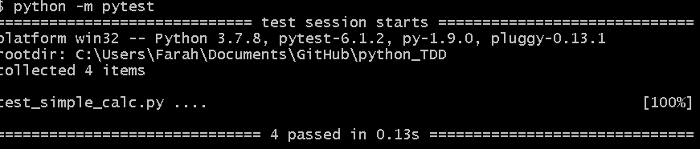

# Test Driven Development (TDD)
Is the method of creating tests, then building code which passes the tests, rather than building code and then tests.


## Why would we use TDD? 
- We know the requirements
- we can make tests based on requirements so any code produced must meet that criteria 
- it's a good way to define acceptance criteria 
- ONE MISTAKE can lead to massive consequences, esp when life is involved. TDD helps us minimise the risk of seding product to production

## Python has several modules that we can use
- pytest
- unitest

## Steps:
- create a file to write our tests 
- we will run the test they will all fail
- create a file to write our code 
- we will refactor and add the code to pass the tests

## Naming Convention for TDD
- file name e.g `simple_calc`
- test file file name e.g `test_simple_calc`

# Steps:
1. Install pytest using the command `pip install pytest` in your terminal
2. Create a test_file and import the necessary modules / files:
```python
# this file will have our tests written

# importing our class and testing modules
from simple_calc import Simple_Calc
import unittest
import pytest
```
3. create a class to contain test functions and write functions to test your to-be-created code:
```python
# let's create a class to run our tests

class Calctest(unittest.TestCase):
# unittest.TestCase works with unittest frame work as parent class

# instantiating our calculator class so we can access its methods
    calc = Simple_Calc()

# IMPORTANT - we MUST use test word in our functions so python interpretor knows what are we testing

    def test_add(self):
# self.assertEqual(self.calc.add(2,4), 6)
        self.assertEqual(self.calc.add(2,4), 6)
# what are we asking python to test for us
# we are asking python to test / check if 2 + 4 = 6 if True pass if False fail the test
    
    def test_subtract(self):
        self.assertEqual(self.calc.subtract(4,2), 2)
# Boolean tests if 4-2 returns 2, then passes / fails accordingly
    def test_multiply(self):
        self.assertEqual(self.calc.multiply(4,4), 16)
        
    def test_devide(self):
        self.assertEqual(self.calc.devide(10,2), 5)
```
4. Being aware of naming convensions, we create another file to contain the class / methods we want to test:
```python
# This file contains our simple calculator class which we will test
class Simple_Calc:
    
    # addition method
    def add(self,a,b):
        return a + b
    
    # subtraction method
    def subtract(self,a,b):
        return a - b
    
    # multiplication method
    def multiply(self,a,b):
        return a * b
    
    # division method
    def devide(self,a,b):
        return a / b
```
5. Save both files. In the terminal use the command `python -m pytest` to test the code. 

The output should look like this:




you can also use `python -m pytest -v` to see more details about which tests failed, % etc. 